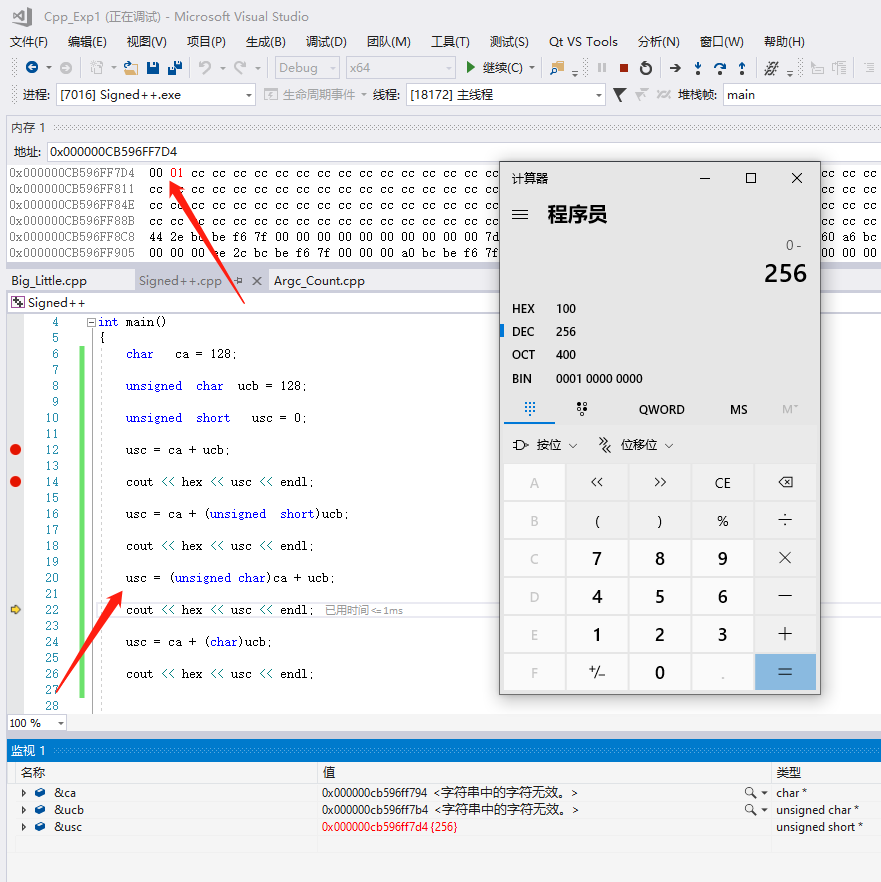

# 作业1 熟悉C++开发环境

## 目的：

复习程序设计的基础知识，熟悉集成开发环境（IDE）的使用方法。

### 关于工具的选择

不管你使用什么样的软件编写和运行C++程序，都离不开一套软件和流程，我们称它们为工具链，一般包括：编辑器、编译工具（编译器、链接器）、调试器等。这些工具可以是单独的软件，比如我可以用记事本作为编辑器来写代码，在命令行调用编译器编译源代码，链接成可执行程序，用命令行调试器来调试程序；当然也可以用一个软件把它们集中起来，称为集成开发环境（IDE，Integrated Development Environment）。你或许已经使用过一些IDE，比如轻量级的Dev-C++和Code::Blocks等，拥有强大插件支持的编辑器VS code也可以称为轻量级IDE，自身仅包含编辑器和图形集成环境，不包含编译器和调试器，需要额外安装相关插件；visual studio包含了编译器和大量的工具，算是重量级的IDE。具体选用哪种IDE，或者使用骨灰级的工具：编辑器之神vi、神的编辑器emacs，根据你的爱好选择即可。记住，工具都是为我们服务的，折腾工具不是我们学习的目的。

比如Dev-C++上手很快，不用创建工程，直接就可以打开源代码进行编译和运行，被称为“最快实现打印hello world的IDE”。有的学长推荐使用Code::Blocks，功能虽然不全面，也是比较简约，但最近几年没有更新。目前最流行、前景最好的轻量级工具当然是VS code，需要你查看资料来安装编译器等工具，并完成配置才能使用。如果省事的话，就用visual studio，有免费的community版。下面的操作以及快捷键是在 visual studio 2017 进行操作的，其他IDE一般也有类似的功能。

## 一、创建工程

一般来说，我们在IDE里进行编程的步骤是：建立工程——编写源码文件——编译——链接——运行和调试——发布程序。本课程的作业基本不涉及发布，但要熟练掌握前面几个步骤。下面的操作是基于VS2017的，目前大部分IDE的操作步骤大都类似。

这里要补充一下，Visual Studio作为一个面向生产的IDE，会用来开发大型的项目。一个项目在Visual Studio里称为solution（解决方案），可以包含多个不同的Project（工程），老古董VC6使用名为workspace来组织多个project，一个project包含若干源代码等文件。project是工程的基本单元。有的IDE仅支持project，不支持多个project组成的solution，一般情况都可以按照这个层次关系创建程序。

打开安装好的VS，创建项目，选择控制台程序或者空项目，修改要创建的项目的名称和路径：

创建完成的项目会在解决方案资源管理器出现，我们可以选中项目名称，右键在文件资源管理器中打开文件夹查看创建的项目文件夹：

## 二、程序的编辑、编译和运行

如果是建立的空项目，需要新建源代码文件，如果是建立的控制台程序，已经预先给创建了源代码文件。

1. 在“Hello_C++_.cpp”中录入代码，Ctrl+S 保存后如下图所示：

2. 编译当前编辑的文件，在编辑窗口的文件是当前正在编辑的。只有扩展名为“.cpp”或“.c”的文件才会被编译。方法为：点击如下菜单栏选项，或者按快捷键Ctrl + F7。
   

编译中如果有编译错误，将显示在下部的输出窗口中。如果编译成功，会在下方的输出一栏显示成功，此时进入该项目文件夹的DeBug子文件夹会生成同名的.obj文件。

3. 点击如下图中的按钮，执行link操作，将生成可执行文件。

在项目文件夹的上一级，可以找到生成的DeBug版本的exe可执行文件。

4. 运行程序。点击下图中的菜单栏选项，或者快捷键Ctrl + F5。

运行成功后会显示控制台窗口如下图：

在Visual Studio和其他IDE中，如果项目已经依次执行上述的编译链接等步骤构建好，则可以直接运行程序。如果项目的某个文件进行了修改，需要重新执行构建步骤，在开发简单的程序时，可以直接点击运行按钮，IDE会对该项目重新进行构建（编译+链接)，生成新的可执行文件后再执行。当然，如果修改后出现了语法错误，构建将不会成功，编译器会将有关语法错误显示在下部的输出窗口中。

## 三、程序的调试（Debug）

出错是人的常态，编程更是这样。面对冷冰冰的电脑，用着所谓的“高级语言”，缺乏经验的菜鸟就不用说了，即使是久经沙场的高手，亦会犯下大大小小的错误。语法错误会在编译的时候发现，令人头疼的往往是“逻辑错误”。当电脑的运行与你的期望不同时，切莫怪电脑，它是最忠诚的，你让他干啥它才干啥。所以，当出现莫名奇妙的逻辑错误时，唯一正确的做法就是静下心来，寻找你的失误吧。寻找错误的过程称为调试（Debug）。常用的方法有：

### 1.设置断点

为程序设置断点，就好比点了程序的穴位，让飞快运行的程序突然间停止前进，任由我们检查。一个程序可以设置多个断点，在以调试状态运行程序时，每次运行到断点所在的代码行，程序就暂停。其手法是：将光标代码行左边灰色列，再要设置断点的地方单击出现红点或者按相应的快捷键F9，则设置程序在运行至该行时暂停。如下图：

其中黄色箭头表示程序将要执行的一行，可以看见，程序被“定”在了我们设置的断点之前，没有继续进行下去。

下方输出栏中，可以再自动窗口或者局部窗口对变量的值以及地址进行观察；

此外，如果想同时监视多个值，可以在输出区域的 “监视1” 自定义需要监视的变量或者其他内容；

我们同样也可以观察变量在内存中是如何存储的：

在程序暂停在断点的情况（调试阶段），点击

就可以在上方看到内存，如果我们复制了监视变量a的地址，输入上方内存栏，或者直接输入&a，即可以观察变量在内存中是如何存储的，以a为例：

若程序中没有断点，则执行程序，控制台调试窗口显示相关信息。

### 2.单步跟踪

单步跟踪（Tracker）可以控制计算机的步伐，令其静止、缓步前进或者全速跳跃，犹如在代码丛中漫游。

以调试方式运行程序或按相应的快捷键，当程序在断点处暂停，断点所在行的代码是下一行要被执行的代码，叫做当前代码行。此时对程序的执行有5个主要选择，重点学会使用单步跟踪。

*单步执行（逐语句）（Step over）*：或者按快捷键F10，单步执行，顾名思义，就是只执行一行代码，然后再暂停。此时程序界面如下图，黄色的箭头指向当前尚未执行的代码行：

*单步进入（逐过程）（Step into）*：或者按快捷键F11，执行一行代码。与step over不同，step into会检查此行中是否有函数调用，如果有的话则进入当前代码行所调用的函数内部，在该函数的第一行代码处暂停，也就是跟踪到函数内部；如果此行中没有函数调用，其作用与单步执行等价。如下图：

单步进入一般只能进入有源代码的函数，如用户自己编写的函数，有的编译器提供了库函数的代码，可以跟踪到库函数里执行。

*运行出函数（跳出）（Step out）*: 或者按快捷键Shift + F11，程序在函数内继续运行，当遇到断点或返回函数调用者时暂停。

*运行到光标（Run to cursor）*: 或者按快捷键Ctrl + F10，继续运行程序，当遇到断点或光标时暂停。

*停止调试（Stop）*: 程序运行终止，回到编辑状态。

当程序调试出现错误时，会在下面的提示窗中显示具体错误内容及位置，双击该错误即可在代码中修改，直到整个程序顺利编译运行。

与此同时，在窗口下方的监视器中可以查看当前执行相关代码对应的变量数值，有利于调试时纠正错误。

上面图片中的代码的目标是交换两个变量的值。

请你使用程序调试的技术，观察main函数和Swap函数内部a、b、&a、&b、x、y、*x、*y、temp这些变量的值是如何随着程序的执行发生变化的。

修改Swap函数，不使用指针。通过调试和观察内存里的变量值，看看为什么无法完成交换任务。

界面左下的变量查看窗口显示的是当前可见变量的情况。另外，在界面的右下方有一块区域“watcher(监视)”，可以用来手动添加你要关注的变量。尝试用一下。

除了在变量监视器里查看变量的值，还可以显示当前内存单元里存储的数据，这样更有利于你去理解程序运行时内存里发生的变化。

*在Visual Studio的一个解决方案下创建了多个项目后，如果要执行其他项目，应该在项目列表-右键-设为启动项，这样F5执行的程序才是要执行的其他程序。*

### 3.命令行参数

 命令行程序的main函数的参数经常省略不写，其实它也有参数的，经常使用两个参数：int argc:参数个数，char **argv：参数列表。某些情况下需要给命令行程序提供参数，就需要使用了。

在大部分IDE里调试命令行程序是直接在IDE里启动程序的，不是从命令行运行该程序，所以大部分IDE在项目设置里提供了向main函数传参的方法：

比如在Visual Studio中，右击项目—>属性—>配置属性—>调试—>命令参数，在命令参数中输入，每个参数之间用空格隔开

在main函数体里，可以使用atoi()等函数将字符串参数转换为数值类型，注意这些函数不是标准库函数，详情可以自行搜索。

在IDE的项目设置里设置好命令行参数后，在调试执行过程中就会直接向程序传入参数。

在命令行环境下执行编译好的命令行程序时，可以win+R-cmd，然后进入要执行exe文件的目录，然后使用程序的名字和参数执行该程序，如下图所示。

### 4.大端小端

在调试程序时，如果查看整型变量short和int类型的变量的内存，会发现字节顺序的问题。

大端模式：高位字节排放在内存的低地址端，低位字节排放在内存的高地址端；

小端模式：低位字节排放在内存的低地址端，高位字节排放在内存的高地址端。

从内存中存储看，高位字节存放在了高地址段，所以我的电脑是小端模式。

### 5. 符号扩展

大家参考这篇博文
https://www.zhihu.com/search?type=content&q=C%2B%2B%E7%AC%A6%E5%8F%B7%E4%BD%8D%E6%89%A9%E5%B1%95

在内存中观察 当第一、二中情况时，usc在内存中因为溢出变成了 00 00

第三种情况时，最终的计算结果应该是 01 00 ，但为什么在内存中是以 00 01 的形式进行存储， 大家可以综合我们上面讲的知识思考一下。

  

## 二、编程作业

请编写以下2个程序。

### 1. Vedic Square and Vedic Star

#### （1）问题描述

Vedic Square（吠陀方形）是一个来源于古印度的数学问题，是一个9×9的表，与九九乘法表类似。只是表的每个格不是行列序号的乘积，而是乘积的数字根。数字根（Digital Root）就是把一个数的各位数字相加，再将所得数的各位数字相加，直到所得数为一位数字为止。而这个一位数便是原来数字的数字根。适用范围为正整数和零。例如:

1的数字根为1

10的数字根为1（1+0=1）

21的数字根为3（2+1=3）

48的数字根为3（4+8=12,1+2=3）

198的数字根为9（1+9+8=18，1+8=9）

注意：任何数加9的数字根还是它本身；9乘任何数字的数字根都是9。

下图是Vedic Square。

 

#### （2）Vedic Star

吠陀方形中有许多几何模式及对称特性。把某个特定的数字用星号替换，其它数字用空格替换，你会发现Vedic Square里呈现出一些对称的图形。

#### （3）编写程序

请编写程序实现打印Vedic Square，然后打印出每个数字（1~9）的Vedic Star图形。比如下面3个图形分别对应数字1,2,3。

 

 

   

### 2. 电梯问题

#### （1）问题描述

有个电梯接到指令，要依次去往N个楼层。电梯上升一层需要6秒，下降一层需要4秒，在到达的楼层停5秒。

给定一个停靠楼层序列，你来计算总共需要花费的时间。电梯初始位置是第0层，而且执行完这个序列后电梯呆在原地，不需要返回到第0层。

#### （2）输入

输入一条序列，一共N+1个自然数，第一个数代表后面需要停靠楼层数量，然后是这N个楼层的数字。

#### （3）输出

打印出电梯停靠完这条序列的楼层花费的总时间。 

#### （4）示例输入和输出

输入为：

1 2

输出为：

17

因为 (6 * 2 + 5)
 

输入为：

3 2 3 1

输出为：

41 

因为：

(6 * 2 + 5 + 6 * 1 + 5 + 4 * 2 + 5)