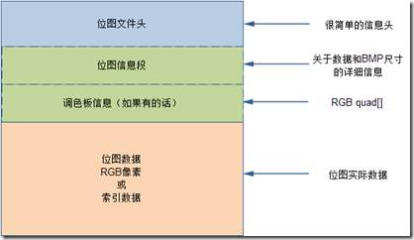
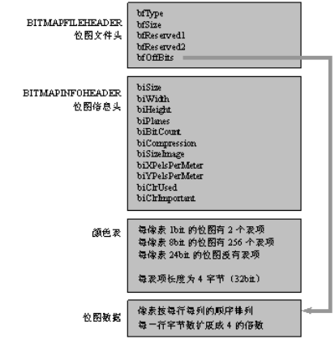
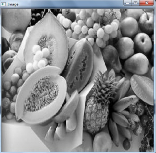
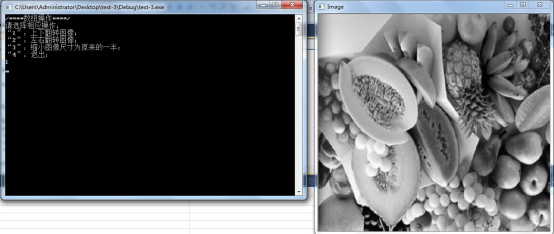
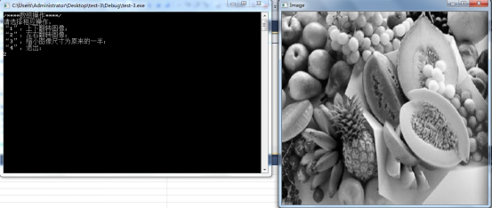
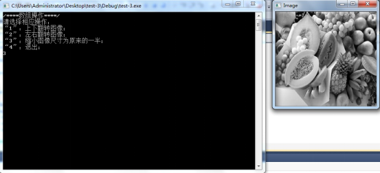

# 作业4 使用数组

# 一、目的

- 掌握BMP文件的读写方法；

- 掌握数组的使用方法；

- 数组的遍历和数组元素的操作；

- 动态分配一维和二维数组；

# 二、内容

后面的作业需要从图片中读入数据，进行处理。我们使用格式比较简单的BMP图像文件。我们先仔细学习一下BMP文件格式的定义和容易出错的地方，下面是关于BMP文件的说明。

**BMP文件的格式和读写操作**

熟悉BMP文件的文件格式，练习文件的读写操作。

BMP文件格式是Windows操作系统推荐和支持的标准图像文件格式，是一种将内存或显示器的图像数据不经过压缩而直接按位存盘的文件格式，故称位图(bitmap)，其扩展名为BMP。BMP图像通常有4个部分组成：文件头、信息头、颜色表、数据。



第一部分为位图文件头BITMAPFILEHEADER。

 

位图文件头结构长度固定为14个字节，包含文件的类型、大小、位图文件保留字、位图数据距文件头的偏移量。其中WORD为无符号16位整数(unsigned short，2字节)，DWORD为无符号32位整数(unsigned long，4字节)。这两个都是为了代码的简洁做的typedef定义。该部分可以使用一个结构体来描述：

```c++
//位图文件头

typedef struct tagBITMAPFILEHEADER
{
    WORD   bfType;  //位图文件的类型，必须为0x4d42 即BM两个字符的ASCII码，注意这里的little endian存储方式，’B’(42)在低位，‘M’(4d)在高位，因此第一个字节是’B’，第二个字节是’M’。
    DWORD  bfSize;  //位图文件的大小，以字节为单位 包括该14字节   
    WORD   bfReserved1; //位图文件保留字，暂时不用，一般为0     
    WORD   bfReserved2; //位图文件保留字，暂时不用，一般为0     
    DWORD  bfOffBits; //位图数据距文件头的偏移量，以字节为单位，即前三部分和
} BITMAPFILEHEADER;
```

 

第二部分为位图信息头BITMAPINFOHEADER，该结构固定为40个字节，用于说明位图的尺寸、宽高、像素、分辨率、颜色表等信息。该部分可以使用一个结构体来描述：

```c++
//位图信息头
typedef struct tagBITMAPINFOHEADER
{
    DWORD   biSize;       //本结构所占用字节数 40字节
    LONG    biWidth;       //位图的宽度，以像素为单位
    LONG    biHeight;      //位图的高度，以像素为单位
    WORD    biPlanes;      //目标设备的级别，必须为1
    WORD    biBitCount;    //每个像素所需的位数，必须是1（双色）、4（16色）、8（256色）或24（真彩色）之一
    DWORD   biCompression;   //位图压缩类型，必须是 0（BI_RGB不压缩）、1（BI_RLE8压缩类型）、2（BI_RLE压缩类型）之一

    DWORD   biSizeImage;      //位图的大小，以字节为单位
    LONG    biXPelsPerMeter;   //位图水平分辨率，每米像素数
    LONG    biYPelsPerMeter;   //位图垂直分辨率，每米像素数
    DWORD   biClrUsed;        //位图实际使用的颜色表中的颜色数
    DWORD   biClrImportant;   //位图显示过程中重要的颜色数 
} BITMAPINFOHEADER;
```

第三部分为颜色表或调色板(Palette)。有些位图需要调色板,有些位图如真彩色图(biBitCount=24)不需要调色板，它们的BITMAPINFOHEADER后面直接是位图数据。调色板实际是一个数组，共有biClrUsed个元素(如果该值为零，则有2的biBitCount次幂个元素)。数组中每个元素的类型是一个RGBQUAD结构，占4字节。定义如下：

```c++
//位图颜色表
typedef struct tagRGBQUAD
{
    BYTE    rgbBlue;		   //蓝色的亮度（值范围为0～255）
    BYTE    rgbGreen;		   //绿色的亮度（值范围为0～255）
    BYTE    rgbRed;		   //红色的亮度（值范围为0～255）
    BYTE    rgbReserved;	   //保留，必须为0
} RGBQUAD;
```

第四部分就是实际的图像数据。对于真彩色图(24位位图 biBitCount=24)，图像数据就是实际的RGB值；对于用到调色板的位图，图像数据就是该像素颜色在调色板中的索引值。下面对2色、16色、256色和真彩色位图分别介绍:

- 2色位图：当biBitCount=1时，用1位就可以表示该像素的颜色(0表示黑,1表示白)，所以8个像素占1个字节；

- 16色位图：当biBitCount=4时，用4为可以表示一个像素的颜色，所以2个像素占1个字节；

- 256色位图：当biBitCount=8时，用1个字节表示1个像素，1个像素占1个字节；

- 真彩色图：当biBitCount=24时，此时用3个字节表示1个像素，其中RGB各占1字节，由于没有颜色表，位图信息头后面是位图数据。

注意以下几点：

1. 由于Windows规定一个扫描所占的字节数必须是4的倍数(即以long为单位)，不足的以0填充。因此，图像每一行的数据最后有可能出现补0。同时注意下面公式，计算只含位图数据的大小：

biSizeImage=(((bi.biWidth*bi.biBitCount)+31)/32*4)*bi.Height

上述公式可以用来验证BMP文件补零的问题。最外层括号计算的是每行的字节数，包括了补的零。在读取文件时可以通过信息头进行查看验证。

2. BMP图片格式的数据是从下到上、从左到右存储的。即文件中最先读到的图像是最下面一行的左边第一个元素，即从左下角开始存储(0,0)点，从左下角到右上角存储数据。另外，如果是真彩色图像，即biBitCount=24，每个像素的3通道像素值的存储顺序，不是RGB，而是BGR。

3. 使用C++读取BMP图片，可以自定义上述结构体，包含BMP位图的位图文件头结构、位图信息头结构、位图颜色表3个结构。Windows API在其库文件wingdi.h中系统定义了BMP图像的结构BITMAPFILEHEADER、BITMAPINFOHEADER，你也可以使用，但是这样你的代码就失去了可移植性。

4. 如果你自定义这些结构体，你可能会掉进**BITMAPFILEHEADER的坑**。用sizeof算一下这个结构体所占的字节数，你会发现结果不是14，而是16，这是由与上面第1条类似的为了效率而默认的4字节对齐原因产生的。请自行搜索“内存对齐Memory Alignment”进行学习。解决办法有3种：1）不使用自定义的结构体，使用windows系统库自带的结构体；2）更改对齐规则；3）不整体读该结构体，而是把该结构体内部的各个元素分别单独读取（我个人喜欢的方式）。网上有很多资料提供解决这个问题的办法：

   - https://blog.csdn.net/xiaosuanzaowb/article/details/8067941
   - https://blog.csdn.net/soundzyt/article/details/1911701
   - https://www.cnblogs.com/jh818012/p/4245044.html

下面这段示例代码展示了读取一幅24位彩色BMP文件，然后保存成另外一个BMP图像文件。这段示例代码使用自己定义的结构体，要处理内存对齐问题，采用的方法是调整对齐策略。这段代码读取的图像每行像素的字节数正好是4的整数倍，所以没有处理补零的情况，仅供参考，你在完成作业时需要考虑该问题。

```c++
#include <cstdio>

#include <cstdlib>

// 针对该结构体的字节对齐问题调整对齐策略
#pragma pack(push,1)
struct BMPFILEHEADER
{
  unsigned short bfType;
  unsigned int   bfSize;
  unsigned short bfReserved1;
  unsigned short bfReserved2;
  unsigned int   bfOffBits;
};
#pragma pack(pop)

struct BITMAPINFOHEADER
{
  unsigned long  biSize;           //本结构所占用字节数 40字节
  long       	   biWidth;          //位图的宽度，以像素为单位
  long           biHeight;         //位图的高度，以像素为单位
  unsigned short biPlanes;         //目标设备的级别，必须为1
  unsigned short biBitCount;       //每个像素所需的位数，必须是1（双色）、
                    		       //4（16色）、8（256色）或24（真彩色）之一
  unsigned long  biCompression;    //位图压缩类型，必须是 0（BI_RGB不压缩）、
                   				   //1（BI_RLE8压缩类型）
                                   //2（BI_RLE压缩类型）之一
  unsigned long  biSizeImage;      //位图的大小，以字节为单位
  long           biXPelsPerMeter;  //位图水平分辨率，每米像素数
  long           biYPelsPerMeter;  //位图垂直分辨率，每米像素数
  unsigned long  biClrUsed;        //位图实际使用的颜色表中的颜色数
  unsigned long  biClrImportant;   //位图显示过程中重要的颜色数 

};


int main()
{   
  FILE* fp = NULL;  				  // C标准库的文件指针
  fopen_s(&fp, "Fruits.bmp", "rb");   // 二进制读取方式打开文件
    
  BMPFILEHEADER bmpfileheader;  	  // 文件头
  BITMAPINFOHEADER bitmapinfoheader;  // 信息头
  // 读取文件头
  fread(&bmpfileheader, sizeof(bmpfileheader), 1, fp);
  // 读取信息头
  fread(&bitmapinfoheader, sizeof(bitmapinfoheader), 1, fp);

  // 计算总的像素个数
  int num_pix = bitmapinfoheader.biHeight * bitmapinfoheader.biWidth;

  // 动态分配一维数组存储像素数据，注意读取的图像是真彩色的，每个像素有3个通道，即每个像素占3个字节
  unsigned char* data = (unsigned char *)malloc(num_pix * 3);

  // 读取像素数据
  fread(data, num_pix * 3, 1, fp);

  // 关闭读取的文件
  fclose(fp);

  FILE* fp2 = NULL; 				  // 保存文件的文件指针
  fopen_s(&fp2, "Fruits2.bmp", "wb"); // 二进制写入方式打开文件
  // 写入文件头
  fwrite(&bmpfileheader, sizeof(bmpfileheader), 1, fp2);
  // 写入信息头
  fwrite(&bitmapinfoheader, sizeof(bitmapinfoheader), 1, fp2);
  // 写入数据
  fwrite(data, num_pix / 2 * 3, 1, fp2);
  // 关闭写入的文件
  fclose(fp2);

  // 释放动态分配的内存
  free(data);

  return 0;

}
```

作业提供的图像是24位真彩色图像，即biBitCount=24，每个像素有3个值（RGB三个通道）来表示，因此没有颜色表那部分数据。

我们进一步简化操作，不考虑颜色信息。后续的作业把图像读入二维数组后再做其他处理，因此要把这个三维的数据（行、列、通道）转换为二维数据（只有行、列）。因此，**实验要求在读取BMP文件的时候，把每个像素的三个像素值转换成一个值，一个简单的做法是取RGB三个通道的平均数。**

本次作业要求读入一幅图像，比如“Fruits.bmp”。将图像数据读入到内存中动态分配的二维数组中。数组的大小是height行，width列，每个元素占1个字节，类型是unsigned char的整数（即在区间[0,255]内）。在读取的时候把图像每个像素的3个通道的值求平均，存入二维数组对应的位置。按照下面的任务处理完后，再写入一幅新的BMP文件。注意，因为在读取的时候计算3通道的平均值，丢失了颜色信息，我们是无法再还原成彩色图像了，因此在把结果保存成BMP图像文件的时候，需要把二维数组的每个元素的值赋值到新图像的3个通道（用该值重复复制到3个通道），结果图像虽然内部有RGB三个通道的数据，但是由于都是同一个值，因此图像显示出来是没有颜色的，称为灰度图。


**请编程实现：**

1. 读取给定的BMP图像。通过读取文件信息头里的biSizeImage的值，验证BMP每行像素所占字节数，是否补0达到4的整数倍。

2. 动态分配二维数组a，将图像数据“降维”后读入a中。这里的“降维”指的是把3通道的彩色图像读取到二维数组中。

3. 将数组a的元素上下翻转。即第一行变为最后一行。即实现函数FlipImageUpDown。

4. 将变换后的数组a写入一幅新的BMP图像文件。如果以上步骤正确，新的图像是原图上下翻转后的图像。

5. 将数组a的元素左右翻转。即第一列变为最后一列。即实现函数FlipImageLeftRight。

6. 将变换后的数组a写入一幅新的BMP图像文件。如果以上步骤正确，会显示左右翻转后的图像。

7. 将图像缩小为原来尺寸的一半，存入动态分配内存的二维数组b。一个简单的做法是将a中的属于奇数行和奇数列的元素读取写入到b中。操作完成后，将b写回硬盘一个新的BMP文件中。


```c++
// 读取BMP图像的函数可以有如下两种形式，读取数据到动态分配的内存块，第一种是以形参传递该内存块的起始地址，第二种是以函数返回值的形式返回。第一种的参数需要使用三级指针，第二种返回的是二级指针，仔细思考为什么要这样设计。请完成这两个重载函数的实现，并在main函数中调用测试。
// 当读入的图像是"Fruits_480x511.bmp"时，这个图像每行字节数不是4的整数倍，文件里每行都有补零，你的函数应该能够正确处理这种情况
void ReadBMP(const char *filename, unsigned char ***d, int &rows, int &cols)
{	
}
unsigned char** ReadBMP(const char *filename, int &rows, int &cols)
{	
}

void WriteBMP(const char *filename, unsigned char **d, int rows, int cols)
{	
  // 同样需要注意你的函数应该能够处理需要补零的情况
}

void FlipImageUpDown(unsigned char **d, int rows, int cols) { }

void FlipImageLeftRight(unsigned char **d, int rows, int cols) { }

void ResizeImage(/*相关的形参*/) { }

int main(int argc, char* argv[])
{
	// 调用你写的读取BMP图像的函数，读取数据到二维数组

	// 调用FlipImageUpDown上下翻转图像

	// 将反转后的数组的数据写入一幅新的图像文件

 	// 调用FlipImageLeftRight左右翻转图像

	// 将反转后的数组的数据写入一幅新的图像文件

	// 将原图缩小为原尺寸的一半，结果存入新的动态二维数组中 
    
	// 将缩小操作后的结果数组的数据写入一幅新的图像文件
  
  return 0;
}
```

## 要求

完成上述代码，并能显示正确的结果图像。

## 注意事项

1. 图像的基本组成单元用“像素”表示，例如如果图像的大小是480*511像素，表示图像的高度（行数）为480像素，宽度（列数）为511像素；

2. 本实例中给的图像都是3通道（24位）的彩色图像。读取到二维数组时要将其通道维数压缩为1维;

3. 二级指针作为函数参数时，应在函数声明时指明其行、列数，否则函数内部无法得知数组的维度；

4. 动态分配的数组，使用完后要及时释放，防止内存的泄漏。

## 效果图(仅供参考)

1. 读入原图像到二维数组后，再保存为另一幅图像。由于丢失了颜色信息，变成了灰度图。

 

2. 图像上下翻转

 

3. 图像左右翻转

 

4. 图像尺寸缩小为原来的一半

 