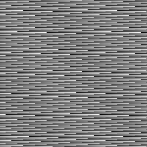
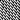
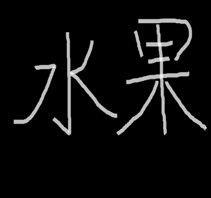
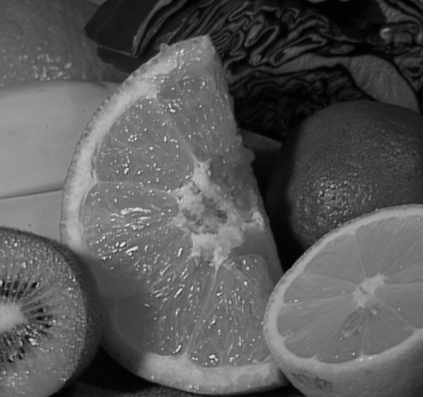
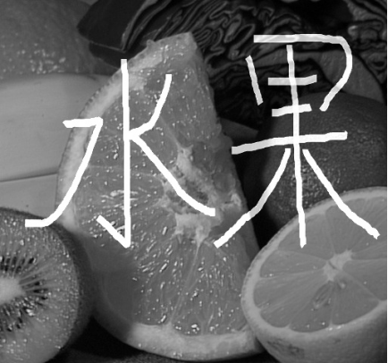
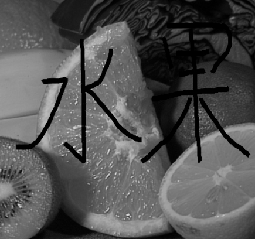
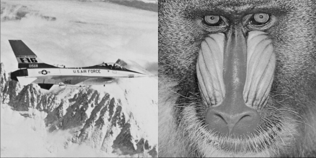
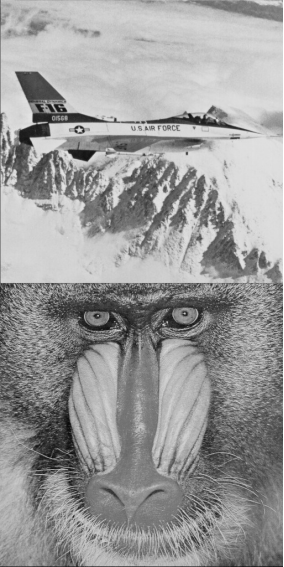

# 作业6 继承

## 一、目的

- 掌握如何编写基类，如何通过继承基类的属性和函数编写派生类。

- 掌握如何在派生类成员函数中调用基类的成员函数。

- 掌握如何声明基类和派生类的对象，如何调用派生类对象的成员函数。

## 二、内容

1. 创建Matrix类，作为Image类的基类。下面的代码已把作业5里的Image类的数据成员“转移至”了父类Matrix中，并将Image类中适用于矩阵的操作“转移至”Matrix类。请完成Matrix类的相关成员函数和友元函数的实现。

2. 从Matrix类公有派生Image类，在Image类中实现一个新的构造函数，该构造函数由基类对象构造派生类对象。

3. 对派生类的某些构造函数进行改造，使其能给基类构造函数传递参数完成基类成员的初始化。

4. 在main函数中完成对Matrix类和Image类成员函数的调用。

***注意：***

自学关于矩阵的基本知识，包括矩阵的加法、减法、转置、单位矩阵等。

类Matrix中的数据类型是double，注意在派生类Image中如何把从图像文件里的数据类型从unsigned char转化为double。更重要的是，在对矩阵完成变换后存储成图像文件时，如何把数据类型再转换回unsigned char。在转换时如何对数据范围进行改变。

图像相加和相减后，结果图像的数据可能是负的或者大于255的，在写回图像文件时，应该处理这种情况。请参考后面的提示设计你的解决办法。

**Matrix.h**

```c++
#ifndef Matrix_H
#define Matrix_H

class Matrix
{
public:
 Matrix();
	Matrix(int h,int w);
	Matrix(int h, int w, double val);
	Matrix(const Matrix &m);
	virtual ~Matrix();

	void ReadText(const char* filename);   //从文本文件中读入图像数据;
	void WriteText(const char* filename); 	//将图像数据保存为文本文件;
	void Zeros(int h, int w); 			// 根据参数产生h行w列的全零矩阵
	void Ones(int h, int w); 			// 根据参数产生h行w列的全1矩阵
	void Random(int h, int w); 			//产生h行w列的随机矩阵，矩阵的元素为[0,1]之间的随机数（double类型）
	void Identity(int n); 				// 根据参数产生n行n列的单位矩阵

    int Height();  						// 获得矩阵的行数
	int Width();   						// 获得矩阵的列数
    Matrix MajorDiagonal();// 求矩阵主对角线上的元素，输出一个N行1列的矩阵，N为主对角线元素的个数
	Matrix MinorDiagonal();// 求矩阵的副对角线上的元素，输出一个N行1列的矩阵，N为副对角线上元素的个数
	Matrix Row(int n);// 返回矩阵的第n行上的元素，输出一个1行N列的矩阵，N为第n行上元素的个数
	Matrix Column(int n);// 返回矩阵的第n列上的元素，输出一个N行1列的矩阵，N为第n列上元素的个数
    
	void Transpose(); 					// 将矩阵转置

    double& At(int row, int col); 		//获取第row行第col列的矩阵元素的引用
    void Set(int row, int col, double value); //设置第row行第col列矩阵元素的值为value
    void Set(double value); 			//设置矩阵所有元素为同一值value

    void Normalize(); // 该函数把矩阵的数据线性缩放至[0,1]区间，即把当前矩阵所有元素中的最小值min变成0，最大值max变为1，其他元素的值线性变到[0,1]区间，公式为：t’=(t-min)/max;

    void Reshape(int h, int w); 	    //在矩阵元素总数不变的情况下，将矩阵行列变为参数给定的大小
    bool IsEmpty();						// 判断矩阵是否为空矩阵
    bool IsSquare();					// 判断矩阵是否为方阵
    void CopyTo(Matrix &m);				// 将矩阵复制给m，“深复制”
    void Mult(double s); 			    // 矩阵的每个元素都乘以参数s
    void Cat(Matrix &m, int code); 	    // 将矩阵m与当前矩阵进行拼接，code代表拼接的方式：将m拼接到当前矩阵的上、下、左、右，具体例子见本大纲后面的说明

    friend Matrix Add(const Matrix &m1, const Matrix &m2); 		// 友元函数，将矩阵m1和m2相加，结果矩阵作为函数的返回值
	friend Matrix Sub(const Matrix &m1, const Matrix &m2);      // 友元函数，将矩阵m1和m2相减，结果矩阵作为函数的返回值
	friend void Swap(Matrix &a, Matrix &b); 			       // 友元函数，交换两个矩阵

protected:
    int height;
    int width;
    double **data;
};

#endif
```

**Image.h**

```c++
#ifndef Image_H
#define Image_H

#include "Matrix.h"

class Image : public Matrix
{
public:
    Image(); 								//构造函数，创建行列都为零的Image对象
    Image(int h, int w); 					//构造函数重载，创建h行，w列的Image对象
    Image(int h, int w, unsigned char val); //构造函数重载，创建的图像像素值都为val;
    Image(const char* ImageName); 		//构造函数重载，利用文件名从硬盘加载图像文件成为Image对象;
    Image(unsigned char m[][100], int n); 	//构造函数重载，从静态数组创建Image对象;
	  Image(unsigned char **m, int h, int w); //构造函数重载，从动态数组创建Image对象;
	  Image(const Matrix &m); 				//构造函数重载，由Matrix类对象构造Image类对象
    Image(const Image &im); 				//拷贝构造函数;
    virtual ~Image(); 						//析构函数;
    
    void ReadBMP(const char* ImageName); 			//从硬盘文件中读入图像数据;
    void WriteBMP(char* filename); 			//将图像数据保存为图像文件;
        
    void Flip(int code); 					//图像的翻转; code为0左右，1 上下;
    void Resize(int h, int w); 				//图像的缩放为参数指定的大小
    void Cut(int x1,int y1,int x2,int y2);  //裁剪点(x1,y1)到点(x2,y2)的图像
    void Rotate(int degree);				//图像旋转的函数（旋转角度为90度的整数倍）
	  double Mean();							//返回图像的均值
	  double Variance();						//求图像的方差
};
#endif
```

**Main.cpp中测试你写的类和函数，以下代码仅为示例，供参考。**

```c++
#include <iostream>
#include "Image.h"

int main(int argc, char* argv[])
{
    Matrix m(160000, 1);
    for (int i = 0; i < 160000; i++)
    {
        m.At(i, 0) = i%256;
    //  m.Set(i,0,i%256);
    }
    m.Reshape(400, 400);
    Image img(m);
    img.WriteBMP("Matrix.bmp");
    
    Matrix d = m.Diagonal();
    Image *p = new Image(d);
    p->WriteBMP("pImage.bmp");
    p->Reshape(20,20);
    p->WriteBMP("pImageReshaped.bmp");
    delete p;
    p = NULL;


	Image im("Fruits.jpg");
	im.Resize(200, 200);
	im.WriteBMP("Resized.bmp");
	im.Rotate(-180);
	im.Show("Rotated.bmp");
    
    Image img1("Fruits.bmp");     
    Image img2("Word.bmp"); 
    
    //两图片相加
	Image img_add(Add(img1, img2)) ;
	img_add.WriteBMP("Add.bmp");

	//两图片相减
    Image img_sub(Sub(img1, img2));
	img_sub.WriteBMP("Sub.bmp");

	//图片的转置
    Image img3("lena.bmp");
    img3.Transpose();
	img3.WriteBMP("Transpose.bmp");

    //在右边拼接图片；
    Image img4("Airplane.bmp"); 
    Image img5("Baboon.bmp");
    img4.Cat(img5,1);
    img4.WriteBMP("CATRight.bmp");
    //在下面拼接图片
    Image img6("Airplane.bmp"); 
    Image img7("Baboon.bmp");
    img6.Cat(img7,2);
    img6.WriteBMP("CATDown.bmp");
    return 0;
}
```

***说明***

1.Reshape函数，顾名思义，将矩阵的形状进行改变。前提是变换前后矩阵元素的个数不能改变，否则应输出错误信息。该变换以行优先的规则将矩阵的元素重新排列。比如有如下3*2的矩阵：

$$
  \begin{bmatrix}
   1 & 2 \\
   3 & 4 \\
   5 & 6 
  \end{bmatrix}
$$

如果对该矩阵进行Reshape（2,3）操作，结果如下：

$$
  \begin{bmatrix}
   1 & 2 & 3 \\
   4 & 5 & 6
  \end{bmatrix}
$$

2.Cat函数将参数m矩阵与调用该函数的矩阵对象进行拼接。比如有矩阵如下：

$$
  \begin{bmatrix}
   1 & 2 \\
   3 & 4
  \end{bmatrix}
$$

参数m矩阵为：

$$
  \begin{bmatrix}
   5 & 6 \\
   7 & 8
  \end{bmatrix}
$$

假设code=1代表拼接到右边，则结果为：

$$
  \begin{bmatrix}
   1 & 2 & 3 & 4 \\
   5 & 6 & 7 & 8
  \end{bmatrix}
$$

假设code=2代表拼接到下面，则结果为：

$$
  \begin{bmatrix}
   1 & 2 \\
   3 & 4 \\
   5 & 6 \\
   7 & 8
  \end{bmatrix}
$$

3.矩阵相加和相减的友元函数，注意处理结果的范围。因为所设计的矩阵的数据存储类型是double，而一般的图像文件能表达的范围是整数0~255，因此，相加或者相减的结果如果超过了这个范围，那么如果要把结果写入图像文件，则要做相应的处理。可以参考如下两种办法：

a)如果相加的结果>255，那么就取255，如果相减的结果<0，则取0。这种方法叫做饱和处理，来自相机拍照时的饱和现象。

b)另外一种处理办法是把数据“缩放”到0~255之间。把矩阵所有元素中的最小值设为0，最大值设为255，其他元素线性插入：255*(x - min) / (max - min)

***结果示例***

产生的矩阵：

 

上面矩阵的对角线元素组成的矩阵（向量）：


上面N*1矩阵经过Reshape变形后的矩阵：



Image1：

 

Image2：

 

Image1 + Image2：

 

Image1–Image2：

 

Transpose：

 

左右拼接：

 

上下拼接：

 