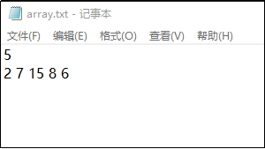
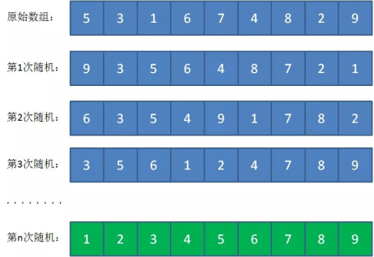
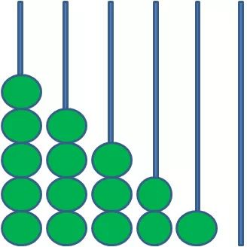
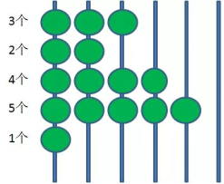
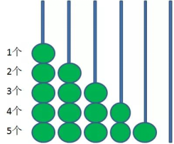
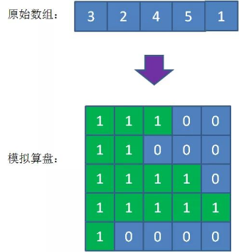
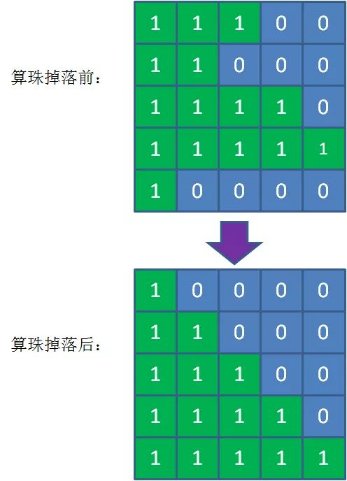
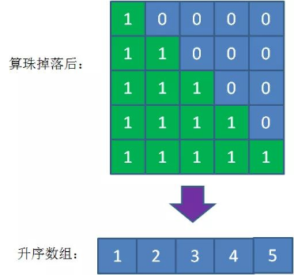

# 作业3 函数的使用--数组排序

## 一、目的

- 练习函数和数组的使用

- 实验几个有趣的排序方法

## 二、内容

### 1 从文件中读取数组信息

在本作业中，使用文本文件记录数组，编写代码从文件中读取数组的数据。比如在文本文件“array.txt”中保存了一维数组，文件第一行是数组元素的个数，第二行是以空格间隔的数组元素，如图所示：

 

由于我们还没学习C++的文件读写，所以暂时使用C标准库的文件读写函数来读取文件中的数组信息。
 
**利用读入的数组，用函数完成以下数组排序算法：**
 

### 2 猴子排序

**（1）问题描述**

一只猴子一直在打印机上胡乱打字，只要有无限的时间，总有一天可以恰好打印出一部莎士比亚的著作。这个理论同样可以用在排序上面。如果我们给数组随机排列顺序，每一次排列之后验证数组是否有序，只要次数足够多，总有一次数组刚好被随机成有序数组。

 

这样的排序算法和猴子用打印机打出莎士比亚著作的理论很相似，所以被称为“猴子排序”。

**（2）设计思路**

如何对数组元素进行随机排列？一个可行的方法是随机挑选数组中的两个元素，交换它们的位置，重复多次就得到一个随机后的数组。使用C语言和C++语言的标准库函数都可以实现。

***C的方法：***

这里直接引用上一次作业中的内容：如果使用C语言系统库，可以使用rand()函数。库函数rand()可以产生在[0, RAND_MAX]范围内的随机整数，可在程序中直接使用，其中RAND_MAX是系统库内定义的宏，代表rand()函数可以产生的最大的整数。通过取余操作可以把生成的整数变换到你想要的范围。例如：rand() % n 会生成[0, n-1]之间的整数。以上函数均在C的标准库stdlib.h中，如果在标准C++项目中，应该使用#include <cstdlib>这个预处理指令。

需要注意的一点是，计算机产生的随机数都是伪随机数，即看起来是随机的，但是如果不做好随机数产生器的初始化，那么每次得到的随机数序列都是相同的。为了程序每次运行得到不同的随机数序列，需要在每次程序运行时给随机数产生器一个不同的种子（基本上就是一个无符号整数）。当然你可以每次让用户输入一个整数作为种子，但是这样肯定会让用户抓狂。比较通用的办法是使用当前系统的时间，比如把当前日期的年月日时分秒的数字加在一起作为种子，这样遇到相同种子的概率是很低的。C标准库里有time函数，该函数返回当前时间，作为随机数种子传给srand函数：srand((unsigned int)time(0))，这样每次程序运行时rand函数就会产生不同的伪随机数序列。

```c++
srand((unsigned int)time(0)); 

unsigned int a[5]; 

for(int i = 0; i < 5; i++) 

	a[i] = rand(); 
```

每次运行上面代码时，数组a里的元素都是不同的随机整数。如果没有srand那行，那么每次运行程序数组a里面的随机数都是相同的，可以自己注释掉试试看。

有了随机数就可以利用它产生随机的数组下标，多次随机交换2个数据元素，得到一个随机排列的数组。

 

***C++的方法：***

C++标准库提供了将容器元素随机排序的shuffle方法。关于什么是“容器”等学习C++的泛型编程时会讲，现在可以简单地理解，数组就是一种存放数据的容器。

如果你使用的是比较老版的C++标准，比如C++0x，那么可以使用random_shuffle函数。需要添加如下头文件：

```c++
#include <algorithm>  // std::random_shuffle 

#include <ctime>    // std::time 

#include <cstdlib>   // std::rand, std::srand 
```

在有些标准库实现版本里（Windows下的MinGW64，v6.0），random_shuffle函数的随机种子可以由srand函数设定，而有些实现版本不行，那么可以自己定义一个基于rand函数的随机数产生函数：

```c++
// random generator function: 
int  myrandom (int i) {return std::rand()%i;} 
```

在主函数里，可以调用random_shuffle函数对数组进行乱序：

```c++
std::srand ( unsigned ( std::time(0) ) ); 

int a[5] = {1, 2, 3, 4, 5}; 

// using built-in random generator: 

std::random_shuffle ( a, a+5 ); 

// using myrandom: 
std::random_shuffle ( a, a+5, myrandom); 
```

上面2种不同的random_shuffle函数调用方法，第二个是使用了我们自己定义的随机数产生器，可以根据自己编译器的实现看看两种方法的不同。

如果你使用的是比较新的C++标准，比如C++17删除了C++0x的random_shuffle函数，程序应该使用C++11添加进去的std::shuffle函数。首先需要添加下面的头文件：

```c++
 #include <algorithm>  // std::shuffle 

 #include <random>    // std::default_random_engine 

 #include <chrono>    // std::chrono::system_clock 
```

这样就可以把一个数组里的元素进行随机排列。

```c++
int a[5] = {1, 2, 3, 4, 5}; 

// 利用系统时间获得一个随机数种子 

unsigned seed = std::chrono::system_clock::now().time_since_epoch().count(); 

shuffle(a, a+5, std::default_random_engine(seed)); // 数组a里面的元素已被乱序 
```


## 3 珠排序

这个排序算法和算盘相似。见过算盘的人都知道，算盘上有许多圆圆的珠子被串在细杆上，就像下面这样：

 

如果把算盘竖起来，会发生什么呢？算盘上的小珠子会在重力的作用下滑到算盘底部，就像下面这样：

 

这里有一个很神奇的细节：如果统计每一横排珠子的个数，你会发现下落后每一排珠子数量恰好是下落前珠子数量的升序排列！

比如上面的例子，下落前后每一横排的珠子数量：

 

那么，我们可以模拟珠子下落的原理，对一组正整数进行排序。用二维数组来模拟算盘，有珠子的位置设为1，没有珠子的位置设为0。那么，一个无序的整型数组就可以转化成下面的二维数组：

 

接下来，我们模拟算盘珠子掉落的过程，让所有的元素1都落到二维数组的最底部：

 

最后，把掉落后的 “算盘” 按行计算总的的珠子数，转化成一维有序数组：

 

这样，排序就完成了。这个排序算法有一个非常形象的名字：珠排序。请你用代码实现这个算法吧。


## 4 面条排序

如果桌子上有一把长短不一的面条，此时你将面条立起来，下端平放在桌面上，此时你用手掌在空中从上往下缓慢移动，慢慢的，你的手掌触碰到了一根面条（这根面条是最高的），你将这根面条抽走（抽走的面条当然想怎么吃就怎么吃），手继续慢慢向下移动，这时，你又碰到了倒数第二高的面条，你又将其抽走，。。。。

算法中，我们用一个数模拟手，每次-1，为了不至于手掌无处安放，我们将手直接放在最高的面条的顶端。

请你用代码实现这个算法吧。

 