# 实验1 熟悉C++开发环境

## 一、**实验目的：**

复习程序设计的基础知识，熟悉集成开发环境（IDE）的使用方法。

**关于工具的选择**

不管你使用什么样的软件编写和运行C++程序，都离不开一套软件和流程，我们称它们为工具链，一般包括：编辑器、编译工具（编译器、链接器）、调试器等。这些工具可以是单独的软件，比如我可以用记事本作为编辑器来写代码，在命令行调用编译器编译源代码，链接成可执行程序，用命令行调试器来调试程序；当然也可以用一个软件把它们集中起来，称为集成开发环境（IDE，Integrated Development Environment）。你或许已经使用过一些IDE，比如Dev-C++，Code::Blocks，VS code，这些都是轻量级的IDE，自身仅包含编辑器和图形集成环境，不包含编译器和调试器，需要你额外安装；又比如visual studio，包含了编译器和大量的工具，算是重量级的IDE。具体选用哪种IDE，或者使用骨灰级的工具：编辑器之神vi、神的编辑器emacs，根据你的爱好选择即可。记住，工具都是为我们服务的，折腾工具不是我们学习的目的。

比如Dev-C++上手很快，不用创建工程，直接就可以打开源代码进行编译和运行，被称为“最快实现打印hello world的IDE”。有的学长推荐使用Code::Blocks，功能虽然不全面，也是比较简约，但最近几年没有更新。目前最流行、前景最好的轻量级工具当然是VS code，需要你查看资料来安装编译器等工具，并完成配置才能使用。如果省事的话，就用visual studio。下面的操作是在VC6（1998年出品，比你们年龄还大）上讲解的，这款IDE虽然很老了，主要是编译器太老了，但基本可以满足我们课程的前半部分内容。其他IDE都有类似的功能。

**一、创建工作空间和项目**

一般来说，我们在IDE里进行编程的步骤是：建立工程——编写源码文件——编译——链接——运行和调试——发布程序。由于我们这里是实验，基本不会有用户使用我们的程序，所以最后一步一般用不到，但是大家要熟练掌握前面几个步骤。下面的操作是基于VC6的，别嫌它老旧，目前大部分IDE的操作步骤也还是这个样子的。

利用Visual C++6.0进行程序开发时，我们首先做一些准备工作，如修改一些常用配置，在工具菜单中，我们点击工具-选项，在弹出的对话框中选择制表符，将制表符设置选为插入空格，点击确定。这一步是可选项，不是必须要做的。现代编辑器在编写代码时都推荐用空格代替制表符，这是因为制表符的宽度在不同的编辑器里时不同的，代码显示效果不一致，影响视觉美观。

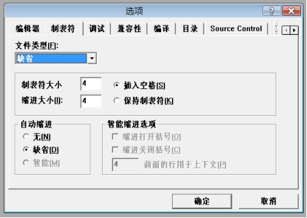 

随后我们开始建立工作空间（Workspace），在这个工作空间中，可以进行多个软件项目（Project）的开发。

这里要补充一下，Visual Studio作为一个面向生产的IDE，会用来开发大型的项目。一个项目可能包含多个不同的工程，VC6里面用workspace来组织多个project，一个project包含若干源代码等文件。project是工程的基本单元。我们在VC6里面可以按照这个层次关系创建程序。在比较新的Visual Studio版本里，project这个名词保留，但是workspace这个名称很不好理解，改称为solution（解决方案）。在有的IDE里仅支持project，不支持多个project组成的solution。

1. 建立一个名为“MyExp”的工作空间。在“File”菜单内选菜单项“New”，在出现的对话框中选择“Workspace”，在工作空间名处输入“MyExp”，并指定空间所在路径。如下图所示。

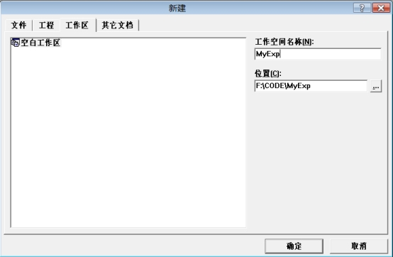 

点击“OK”按钮，建立Workspace。如下图：

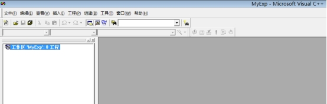 

 

 

2. 在工作空间中建立Project，一个工作空间可以有多个Project。 在“File”菜单内选菜单项“New”，在出现的对话框中选择“Projects”，其类型为“Win32 Console Application”，在项目名处输入“Exp”，选好项目所在路径（即刚建好的工作空间），并选择“Add to current workspace”。如下图：

 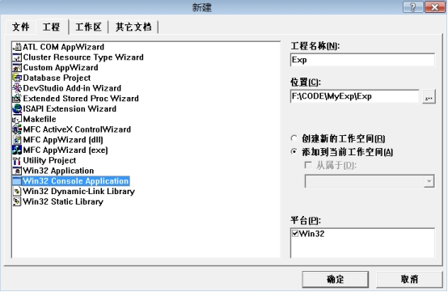

**注意，一定要选择Project的类型“Win32 Console Application”，即控制台应用程序。**

点击OK，弹出的对话框按默认选项确认，即可生成新的Project。

3. Project的文件构成（File View）如下图所示。Source Files存放源代码文件（扩展名为.cpp，.c等）。Header Files存放头文件（扩展名为.h）。如下图：

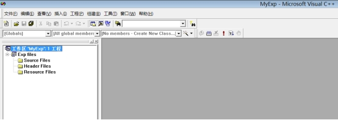 

4. 添加项目代码文件（后缀为.cpp）

在“File”菜单内选择菜单项“New”，或者用快捷键Ctrl+N，存现以下对话框，**选择文件类型为“C++ Source File”。**起名为“HelloWorld”，点击OK。如下图：

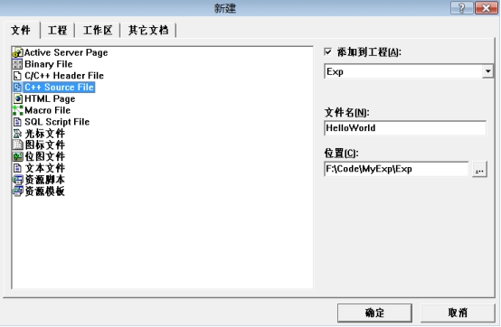 

5. 编辑代码文件

在第四步点击OK后，自动进入新建的HelloWorld.cpp文件，可以在文件添加代码。如下图：

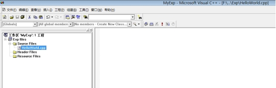 

二、**程序的编辑、编译和运行**

1. 在“HelloWorld.cpp”中录入代码如下图所示：

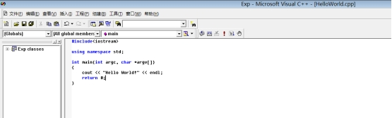 

2. 编译当前编辑的文件，在编辑窗口的文件是当前正在编辑的。只有扩展名为“.cpp”或“.c”的文件才会被编译。方法为：点击按钮，或者按快捷键Ctrl + F7。编译中如果有语法错误，将显示在下部的输出窗口中。点击按钮，或者按快捷键F7，执行build操作，包括编译和链接两个过程。

3. 运行程序。点击 按钮，或者快捷键Ctrl + F5。此时，如果活动的项目已经构建好，则直接执行可执行程序；如果对项目的某个文件进行了修改，则首先对该项目进行重构建，生成新的可执行文件后，再执行。当然，如果修改后出现了语法错误，构建将不会成功，有关语法错误显示在下部的输出窗口中。运行成功后会显示控制台窗口如下图：

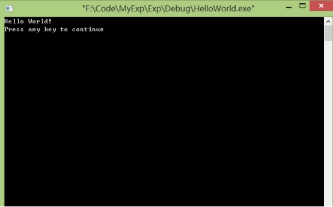 

 

**三、程序的调试（Debug）**

出错是人的常态，编程更是这样。面对冷冰冰的电脑，用着所谓的“高级语言”，缺乏经验的菜鸟就不用说了，即使是久经沙场的高手，亦会犯下大大小小的错误。语法错误会在编译的时候发现，令人头疼的往往是“逻辑错误”。当电脑的运行与你的期望不同时，切莫怪电脑，它是最忠诚的，你让他干啥它才干啥。所以，当出现莫名奇妙的逻辑错误时，唯一正确的做法就是静下心来，寻找你的失误吧。寻找错误的过程称为调试（Debug）。常用的方法有：

**1. 设置断点**

为程序设置断点，就好比点了程序的穴位，让飞快运行的程序突然间停止前进，任由我们检查。一个程序可以设置多个断点，在以调试状态运行程序时，每次运行到断点所在的代码行，程序就暂停。其手法是：将光标移至该代码行，然后按F9键（或菜单快捷键），则设置程序在运行至该行时暂停。如下图：

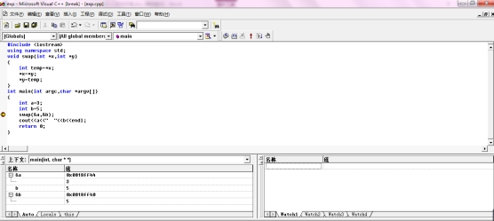 

若程序中没有断点出现，则结果又会有什么不同呢？如图所示：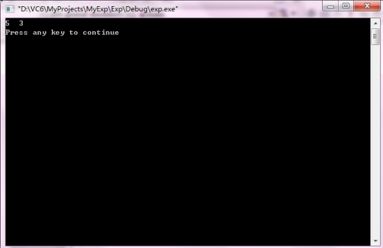

**2. 单步跟踪**

单步跟踪（Tracker）可以控制计算机的步伐，令其静止、缓步前进或者全速跳跃，犹如在代码丛中漫游。

按F5快捷键，以调试方式运行程序。当程序在断点处暂停，就进入了单步跟踪状态。断点所在行的代码是下一行要被执行的代码，叫做当前代码行。此时对程序的执行有5个主要选择。

单步执行（Step over）或者按快捷键F10：单步执行，顾名思义，就是只执行一行代码，然后再暂停。此时程序界面如下图，黄色的箭头指向当前尚未执行的代码行：

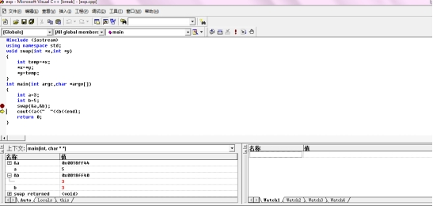 

 

 单步进入（Step into）:或者按快捷键F11，执行一行代码。与step over不同，step into会检查此行中是否有函数调用，如果有的话则进入当前代码行所调用的函数内部，在该函数的第一行代码处暂停，也就是跟踪到函数内部；如果此行中没有函数调用，其作用与单步执行等价。如下图：

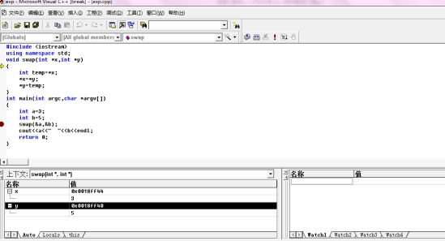 

单步进入一般只能进入有源代码的函数，如用户自己编写的函数，有的编译器提供了库函数的代码，可以跟踪到库函数里执行。

*运行出函数（Step out）*: 或者按快捷键Shift + F11，程序在函数内继续运行，当遇到断点或返回函数调用者时暂停。

运行到光标（Run to cursor）: 或者按快捷键Ctrl + F10，继续运行程序，当遇到断点或光标时暂停。

*停止调试（Stop）*: 程序运行终止，回到编辑状态。

当程序调试出现错误时，会在下面的提示窗中显示具体错误内容及位置，双击该错误即可在代码中修改，直到整个程序顺利编译运行。

与此同时，在窗口下方的监视器中可以查看当前执行相关代码对应的变量数值，有利于调试时纠正错误。

上面图片中的代码的目标是交换两个变量的值。请你使用程序调试的技术，观察main函数和Swap函数内部a、b、&a、&b、x、y、*x、*y、temp这些变量的值是如何随着程序的执行发生变化的。

修改Swap函数，不使用指针。通过调试和观察内存里的变量值，看看为什么无法完成交换任务。

界面左下的变量查看窗口显示的是当前可见变量的情况。另外，在界面的右下方有一块区域“watcher”，可以用来手动添加你要关注的变量。尝试用一下。

除了在变量监视器里查看变量的值，还可以显示当前内存单元里存储的数据，这样更有利于你去理解程序运行时内存里发生的变化。

 

# 二、实验内容

请编写以下2个程序。

## **1.1** Vedic Square and Vedic Star

**（1）问题描述**

Vedic Square（吠陀方形）是一个来源于古印度的数学问题，是一个9×9的表，与九九乘法表类似。只是表的每个格不是行列序号的乘积，而是乘积的数字根。数字根（Digital Root）就是把一个数的各位数字相加，再将所得数的各位数字相加，直到所得数为一位数字为止。而这个一位数便是原来数字的数字根。适用范围为正整数和零。例如:

 

1的数字根为1

 

10的数字根为1（1+0=1）

 

21的数字根为3（2+1=3）

 

48的数字根为3（4+8=12,1+2=3）

 

198的数字根为9（1+9+8=18，1+8=9）

 

注意：任何数加9的数字根还是它本身；9乘任何数字的数字根都是9。

下图是Vedic Square。

 

 

**（2）Vedic Star**

吠陀方形中有许多几何模式及对称特性。把某个特定的数字用星号替换，其它数字用空格替换，你会发现Vedic Square里呈现出一些对称的图形。

**（3）编写程序**

请编写程序实现打印Vedic Square，然后打印出每个数字（1~9）的Vedic Star图形。比如下面3个图形分别对应数字1,2,3。

​                                                                                                     

​                                                                                                     

    

## **1.2** 电梯

**（1）问题描述**

有个电梯接到指令，要依次去往N个楼层。电梯上升一层需要6秒，下降一层需要4秒，在到达的楼层停5秒。

给定一个停靠楼层序列，你来计算总共需要花费的时间。电梯初始位置是第0层，而且执行完这个序列后电梯呆在原地，不需要返回到第0层。

**（2）输入**

输入一条序列，一共N+1个自然数，第一个数代表后面需要停靠楼层数量，然后是这N个楼层的数字。

**（3）输出**

打印出电梯停靠完这条序列的楼层花费的总时间。 

**（4）示例输入和输出**

输入为：

1 2

输出为：

17

因为 (6 * 2 + 5)

 

输入为：

3 2 3 1

输出为：

41 

因为：

(6 * 2 + 5 + 6 * 1 + 5 + 4 * 2 + 5)