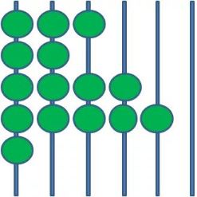
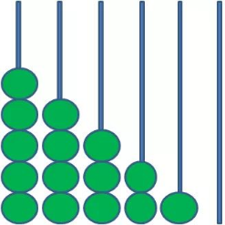
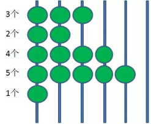
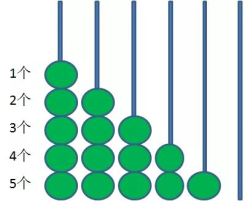
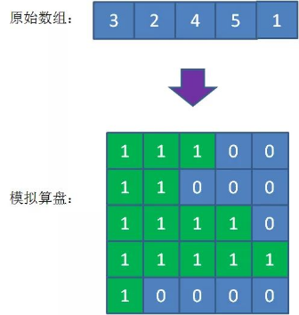
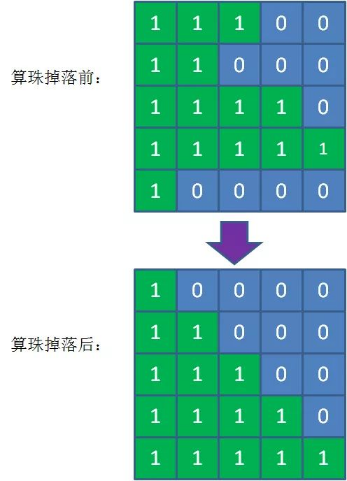
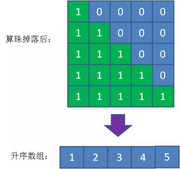

# 实验二   控制结构和函数

# **1** 实验目的

（1）灵活掌握控制结构及其逻辑特点，学会逐步求精的算法设计。

（2）学习如何把逻辑结构相同的部分抽象为函数，以提高代码的可重用性，达到提高程序的可维护性的目的。

（3）学习使用数组作为函数参数的方法。

# **2** 实验内容

## **2.1** 打印温度柱状图

**（1）问题描述**

下图是某城市15天的气温变化曲线。其中标注为A的地方称为峰点，标记为B的地方称为谷点，而标记为C的地方称为崮。要求编写1个函数输入15天的气温，然后通过3个函数分别实现下述功能：

（1）打印每天温度的柱状图（仅考虑温度为正值的情况）。

（2）打印所有峰点的位置（该月的第几天）及峰值。如果没有，则打印没有峰值。

（3）打印最长的崮的长度。**只使用一重循环即可求出。**

 

**（2）问题要求**

请实现以下函数声明，要求能得到如下图所示的运行结果。

 

 

 

## **2.2** 处理零下温度

（1）要求柱状图能够处理多个零下温度的情况，以如下形式打印。（10分）

 

（2）求出现次数最多的温度，及其出现次数。（10分）

例如：12  13  12  12  14  13  13  12  13  13 中，出现次数最多的是13度，出现了5次。

## **2.3** 猴子排序

**（1）问题描述**

一只猴子一直在打印机上胡乱打字，只要有无限的时间，总有一天可以恰好打印出一部莎士比亚的著作。这个理论同样可以用在排序上面。如果我们给数组随机排列顺序，每一次排列之后验证数组是否有序，只要次数足够多，总有一次数组刚好被随机成有序数组。

 

 

  这样的排序算法和猴子用打印机打出莎士比亚著作的理论很相似，所以被称为“猴子排序”。

**（2）设计思路**

如何对数组元素进行随机排列？一个可行的方法是随机挑选数组中的两个元素，交换它们的位置，重复多次就得到一个随机后的数组。使用C语言和C++语言的标准库函数都可以实现。

**C方法：**

如果使用C语言系统库，可以使用rand()函数。库函数rand()可以产生在[0, RAND_MAX]范围内的随机整数，可在程序中直接使用，其中RAND_MAX是系统库内定义的宏，代表rand()函数可以产生的最大的整数。通过取余操作可以把生成的整数变换到你想要的范围。例如：rand() % n 会生成[0, n-1]之间的整数。以上函数均在C的标准库stdlib.h中，如果在标准C++项目中，应该使用#include <cstdlib>这个预处理指令。

需要注意的一点是，计算机产生的随机数都是伪随机数，即看起来是随机的，但是如果不做好随机数产生器的初始化，那么每次得到的随机数序列都是相同的。为了程序每次运行得到不同的随机数序列，需要在每次程序运行时给随机数产生器一个不同的种子（基本上就是一个无符号整数）。当然你可以每次让用户输入一个整数作为种子，但是这样肯定会让用户抓狂。比较通用的办法是使用当前系统的时间，比如把当前日期的年月日时分秒的数字加在一起作为种子，这样遇到相同种子的概率是很低的。C标准库里有time函数，该函数返回当前时间，作为随机数种子传给srand函数：srand((unsigned int)time(0))，这样每次程序运行时rand函数就会产生不同的伪随机数序列。

```c++
srand(unsigned int)time(0);
unsigned int a[5];
for(int i=0;i<5;i++)
    a[i]=rand();
```

每次运行上面代码时，数组a里的元素都是不同的随机整数。如果没有srand那行，那么每次运行程序数组a里面的随机数都是相同的，可以自己注释掉试试看。

有了随机数就可以利用它产生随机的数组下标，多次随机交换2个数据元素，得到一个随机排列的数组。

**C++的方法：**

C++标准库提供了将容器元素随机排序的shuffle方法。关于什么是“容器”等我们学习C++的泛型编程时会讲，现在可以简单地理解，数组就是一种存放数据的容器。

如果你使用的是比较老版的C++标准，比如C++0x，那么可以使用random_shuffle函数。需要添加如下头文件：

```c++
#include <algorithm>  // std::random_shuffle 

#include <ctime>    // std::time 

#include <cstdlib>   // std::rand, std::srand 
```

在有些标准库实现版本里（Windows下的MinGW64，v6.0），random_shuffle函数的随机种子可以由srand函数设定，而有些实现版本不行，那么可以自己定义一个基于rand函数的随机数产生函数：

```c++
// random generator function: 

int  myrandom (int i) { return std::rand()%i;} 
```

在主函数里，可以调用random_shuffle函数对数组进行乱序：

```c++
std::srand ( unsigned ( std::time(0) ) ); 

int a[5] = {1, 2, 3, 4, 5}; 

// using built-in random generator: 

std::random_shuffle ( a, a+5 ); 

// using myrandom: 

std::random_shuffle ( a, a+5, myrandom); 
```

上面2种不同的random_shuffle函数调用方法，第二个是使用了我们自己定义的随机数产生器，可以根据自己编译器的实现看看两种方法的不同。

如果你使用的是比较新的C++标准，比如C++17删除了C++0x的random_shuffle函数，程序应该使用C++11添加进去的std::shuffle函数。首先需要添加下面的头文件：

```c++
#include <algorithm>  // std::shuffle 

#include <random>    // std::default_random_engine 

#include <chrono>    // std::chrono::system_clock 
```

这样就可以把一个数组里的元素进行随机排列。

```c++
int a[5] = {1, 2, 3, 4, 5}; 

// 利用系统时间获得一个随机数种子 

unsigned seed = std::chrono::system_clock::now().time_since_epoch().count(); 

shuffle(a, a+5, std::default_random_engine(seed)); // 数组a里面的元素已被乱序 
```


## **2.4** 珠排序

  这个排序算法和算盘相似。见过算盘的人都知道，算盘上有许多圆圆的珠子被串在细杆上，就像下面这样：

 

  如果把算盘竖起来，会发生什么呢？算盘上的小珠子会在重力的作用下滑到算盘底部，就像下面这样：

 

  这里有一个很神奇的细节：如果统计每一横排珠子的个数，你会发现下落后每一排珠子数量恰好是下落前珠子数量的升序排列！

  比如上面的例子，下落前后每一横排的珠子数量：

 

那么，我们可以模拟珠子下落的原理，对一组正整数进行排序。用二维数组来模拟算盘，有珠子的位置设为1，没有珠子的位置设为0。那么，一个无序的整型数组就可以转化成下面的二维数组：

 

接下来，我们模拟算盘珠子掉落的过程，让所有的元素1都落到二维数组的最底部：

 

最后，把掉落后的 “算盘” 转化成一维有序数组：

 

 

这样，排序就完成了。这个排序算法有一个非常形象的名字：珠排序。请你用代码实现这个算法吧。

## **2.5** 面条排序

如果桌子上有一把长短不一的面条，此时你将面条立起来，下端平放在桌面上，此时你用手掌在空中从上往下缓慢移动，慢慢的，你的手掌触碰到了一根面条（这根面条是最高的），你将这根面条抽走（抽走的面条当然想怎么吃就怎么吃），手继续慢慢向下移动，这时，你又碰到了倒数第二高的面条，你又将其抽走，。。。。

算法中，我们用一个数模拟手，每次-1，为了不至于手掌无处安放，我们将手直接放在最高的面条的顶端。

请你用代码实现这个算法吧。

 