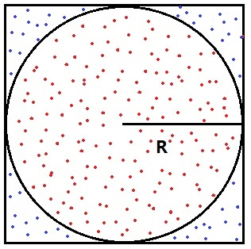

# 实验2 统计的方法求π

# 一、实验目的

熟练运用循环和数值计算

# 二、实验内容

有一个正方形和它的内切圆。圆的半径为R，则正方形的边长为2R，内切圆与正方形的面积比：


如果在正方形区域内随机产生大量的均匀分布的点，那么落入内切圆和正方形中的随机点个数的比值等于它们的面积之比。该比值乘以4，即为π值。

 

算法思路：

记住，我们在做这个实验的时候不知道pi的值到底是多少，因此不知道用多少个随机点才能够求得比较准确的pi值。我们求解的终止条件是计算的结果达到某种“满意度”，这个“满意度”在本实验中就是pi的精度。

因此，你需要设置一个合理的精度e，比如e=0.01。我们使用多轮的计算，每一轮都产生大量的随机点（比如N个），然后计算统计落入圆内的点的个数（比如M个）。重复计算多轮，每轮都把新的统计后的点数加入到计算过程中，随着轮数的增加，得到的pi值将逐渐逼近真实的pi值，相邻两轮间计算的pi值的差也将逐渐减小，直至低于设定的精度。具体如下：

第一轮N个点计算的pi值为，第二轮计算的pi值为，第三轮计算的pi值为 ……

  轮数越多，使用的点越多，那么这个值理论上越接近真实的pi。那么到底需要多少轮呢？这就是我们最外层循环条件“精度”所决定的了。当新一轮的N个点加入到计算过程中，我们要判断新的pi值相对于前面一轮的pi值到底“改进”了多少，如果这个“改进”比所设的精度都小，那么就可以退出计算并返回结果了。

 

**伪算法描述：**

首先给pi一个初始值，比如100（我们不知道pi的值是多少，随便先猜一个，别告诉我你猜的是3.1415926）。还要初始化另一个变量：当前计算的pi值和上次计算的pi值之间的差residual，要初始化为一个比较大的值比如100。当然了，你还得初始化记录所有随机点数的累加器为零，把记录所有落入圆内点数的累加器置零。

while 差值residual > 精度e

  for循环，要在该循环内产生N个随机点

​    计算落入圆内的点的个数M；

  M累加到记录所有圆内点个数的变量中；

  计算新的pi值；

  计算新的residual值；

  将新的pi值赋给存储旧pi值的变量

输出计算的pi值

 

本次实验的主要内容是利用上述方法计算π，以给定的精度作为求π循环的终止条件。要求：

1. 合理使用while循环和for循环；

2. 设定合适的终止条件。

3. 练习单步跟踪调试程序。

4. 注意变量的可取值范围。

 

**提示：**

1. 在main函数里，进入求pi循环之前，使用系统库的time函数产生srand函数所需要的随机数种子：srand(time(0))

这样每次运行程序会产生不同的伪随机数序列。

2. 库函数rand()可以产生在[0, RAND_MAX]范围内的随机整数，可在程序中直接使用，其中RAND_MAX是系统库内定义的宏，代表rand()函数可以产生的最大的整数。通过强制类型转换和缩放可以把生成的整数变换到任意的范围。例如：

double d = double(rand()) / double(RAND_MAX); // d是转换后的0到1之间的浮点数

大纲最后还有一些更具体地说明，供参考。

3. 求解pi的过程要使用2层循环。最外层的循环判断是否达到终止条件，内层循环产生一定数量的随机点。

 

```c++
#include <iostream>

using namespace std;

int main(int argc, char* argv[])
{

	// 声明所用的变量并正确初始化
	// 用当前的时间作为种子初始化随机数产生器


	// 编写求pi的循环

	// 外层循环判断是否达到预设精度

{

	 	// 内层循环产生一批随机点进行逼近

     	 	// 调用rand（）函数，产生随机二维点（两个随机数：x坐标和y坐标）

     		// 将随机数变换到正方形所在的区间，利用宏RAND_MAX

			// 计算点是否在圆内

		// 更新统计数据，求pi值

		// 控制台输出当前计算得到的pi值

}

	// 在控制台输出最终得到的pi值

 

  return 0;

}
```


# 实验要求

完成上述代码，并能显示正确的π值计算结果。

看看所计算的pi值的精度能达到小数点后多少位，试分析原因。

请多试验几个参数N的值，看看多少比较合适。N的值太大或太小会导致什么问题，试着分析原因。

 

# 关于随机数的补充知识

关于C语言和C++语言中的随机数，在其各自的标准库函数都有实现。

如果使用C标准库，可以使用rand()函数。库函数rand()可以产生在[0, RAND_MAX]范围内的随机整数，可在程序中直接使用，其中RAND_MAX是系统库内定义的宏，代表rand()函数可以产生的最大的整数。通过取余操作可以把生成的整数变换到你想要的范围。例如：rand() % n 会生成[0, n-1]之间的整数。以上函数均在C的标准库stdlib.h中，如果在标准C++项目中，应该使用#include <cstdlib>这个预处理指令。

需要注意的一点是，计算机产生的随机数都是伪随机数，即看起来是随机的，但是如果不做好随机数产生器的初始化，那么每次得到的随机数序列都是相同的。为了程序每次运行得到不同的随机数序列，需要在每次程序运行时给随机数产生器一个不同的种子（基本上就是一个无符号整数）。当然你可以每次让用户输入一个整数作为种子，但是这样肯定会让用户抓狂。比较通用的办法是使用当前系统的时间，比如把当前日期的年月日时分秒的数字加在一起作为种子，这样遇到相同种子的概率是很低的。C标准库里有time函数，该函数返回当前时间，作为随机数种子传给srand函数：srand((unsigned int)time(0))，这样每次程序运行时rand函数就会产生不同的伪随机数序列。

```c++
srand((unsigned int)time(0)); 

unsigned int a[5]; 

for(int i = 0; i < 5; i++) 

 	a[i] = rand(); 
```

每次运行上面代码时，数组a里的元素都是不同的随机整数。如果没有srand那行，那么每次运行程序数组a里面的随机数都是相同的，可以自己注释掉试试看。

 